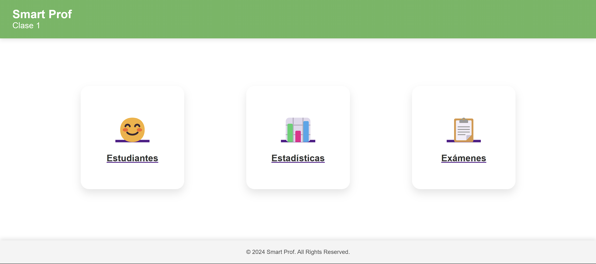
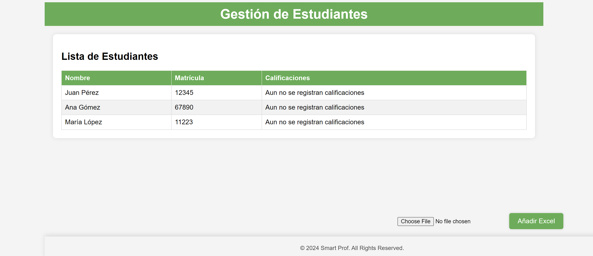

# Sistema de Evaluación Automática de Exámenes con Django y Google Vision

Este proyecto es una plataforma web construida con Django que automatiza el proceso de corrección de exámenes mediante el reconocimiento de texto en imágenes, utilizando la API de Google Cloud Vision. La plataforma está diseñada para ayudar a los maestros a evaluar exámenes de forma eficiente y rápida, permitiendo la corrección automática basada en las respuestas que los estudiantes proporcionan en imágenes escaneadas de sus exámenes.

## Características

- **Registro de Clases y Exámenes**: Los maestros pueden registrar nuevas clases y crear exámenes con preguntas y respuestas predefinidas.
- **Subida de Imágenes**: Los estudiantes pueden subir una imagen de su examen a la plataforma para ser evaluados.
- **Corrección Automática**: Utilizando la API de Google Cloud Vision, el sistema detecta el texto en la imagen del examen, extrae las respuestas proporcionadas por el estudiante y las compara con las respuestas correctas almacenadas en la base de datos.
- **Calificación Automática**: La plataforma calcula automáticamente la calificación del examen, basada en el número de respuestas correctas.
- **Gestión de Estudiantes y Calificaciones**: El sistema identifica al estudiante mediante su matrícula, almacena su calificación y permite ver su progreso académico a lo largo del tiempo.
- **Interfaz Intuitiva**: La interfaz de usuario está diseñada para ser simple y fácil de usar, tanto para maestros como para estudiantes.

## Tecnologías Utilizadas

- **Django**: Framework web para el backend y manejo de la lógica de la aplicación.
- **Google Cloud Vision API**: Para el reconocimiento de texto en las imágenes de los exámenes.
- **HTML, CSS y JavaScript**: Para la creación de una interfaz de usuario moderna y funcional.
- **PostgreSQL**: Base de datos relacional utilizada en producción. (SQLite puede ser utilizado en entornos de desarrollo).
- **Python**: Lenguaje de programación utilizado para desarrollar la aplicación.


## Requisitos Previos

- Python 3.x
- Django
- Cuenta de Google Cloud y configuración de la API de Vision
- PostgreSQL (opcional, para producción)
- Git

## Instalación

1. Clona este repositorio:
    ```bash
    git clone https://github.com/tu_usuario/nombre_del_repositorio.git
    cd nombre_del_repositorio
    ```

2. Crea y activa un entorno virtual:
    ```bash
    python -m venv env
    source env/bin/activate  # En Windows: env\Scripts\activate
    ```

3. Instala las dependencias necesarias:
    ```bash
    pip install -r requirements.txt
    ```

4. Configura la API de Google Cloud Vision añadiendo tu archivo de credenciales en tu entorno:
    ```bash
    export GOOGLE_APPLICATION_CREDENTIALS="path/to/credentials.json"
    ```

5. Realiza las migraciones de la base de datos:
    ```bash
    python manage.py migrate
    ```

6. Inicia el servidor de desarrollo:
    ```bash
    python manage.py runserver
    ```

7. Accede a la aplicación en `http://127.0.0.1:8000/`.

## Uso

1. **Maestros**: Pueden crear clases y registrar exámenes desde el panel de administración de Django o desde la interfaz de usuario.
2. **Estudiantes**: Suben una imagen de su examen y el sistema procesa automáticamente las respuestas y les asigna una calificación.

## Contribuciones

Si deseas contribuir a este proyecto, siéntete libre de hacer un fork del repositorio y enviar tus cambios mediante un pull request.

## Licencia



